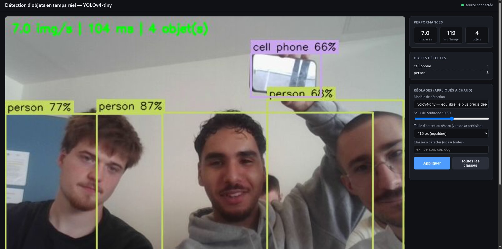

# Architecture distribuée pour le traitement d'images

**IA03 — Projet 1 — Rapport**

Mehdi Ez-Zouak, Paul Louis Ledoux et Clément Menaucourt — UTT, septembre 2026

Code du projet : <https://github.com/Mehdi7765/ComputerVisionProjectIA03>

---

## 1. Ce qu'on devait faire

Le but du projet était de faire tourner une chaîne de traitement d'images sur plusieurs ordinateurs en même temps : un PC qui filme avec sa webcam et envoie la vidéo sur le réseau, un autre PC qui récupère cette vidéo et fait tourner un modèle de détection d'objets dessus, et enfin un moyen de regarder le résultat depuis n'importe quel appareil connecté au même Wi-Fi, avec juste un navigateur.

On est partis des quatre scripts donnés en TP (`diffusion_http.py`, `lecture_http.py`, `diffusion_gstreamer.py` et `diffusion_rtsp_ffmpeg.py`). On les a gardés avec leurs noms et on les a modifiés au fur et à mesure. Pour s'y retrouver, chaque changement dans le code est marqué par un commentaire `[MODIF]` qui explique pourquoi on l'a fait, et on a laissé les versions d'origine dans `docs/scripts_origine/` pour pouvoir comparer.

## 2. Comment ça marche

### 2.1 Vue d'ensemble

*Figure 1 — Les trois machines et ce qui circule entre elles. Les adresses IP sont des exemples, les vraies changent selon le réseau sur lequel on se connecte.*

Il y a trois rôles, et chacun correspond à un script :

- le **PC capture** fait tourner `diffusion_http.py`. Il lit la webcam et envoie les images sur le réseau (port 5000) ;
- le **PC analyse** fait tourner `lecture_http.py`. Il récupère les images du PC capture, passe chaque image dans YOLO, dessine les boîtes et renvoie l'image annotée sur le réseau avec une petite page web (port 8000) ;
- la **consultation**, c'est n'importe quel téléphone ou PC qui ouvre la page web du PC analyse. Il n'y a rien à installer.

Un point qui nous paraissait important : n'importe quel ordinateur peut jouer n'importe quel rôle, il suffit de lancer le bon script. Pendant nos essais on a d'ailleurs changé plusieurs fois de PC capture selon qui avait la meilleure webcam. On a aussi testé avec deux PC capture et un seul PC analyse, qui lance alors deux analyses sur deux ports différents.

### 2.2 Le PC capture

`diffusion_http.py` ouvre la webcam avec OpenCV et sert un flux MJPEG avec Flask. Concrètement, chaque image est compressée en JPEG et envoyée dans une réponse HTTP qui ne se termine jamais (type `multipart/x-mixed-replace`). C'est un format un peu vieux mais qui a un gros avantage : un navigateur l'affiche directement avec une balise ``, et OpenCV sait le lire avec `cv2.VideoCapture(url)`.

La modification la plus importante par rapport au script du TP concerne l'ouverture de la caméra. Dans la version d'origine, `cv2.VideoCapture(0)` était appelé dans la fonction `generate_frames()`, donc à chaque fois qu'un client se connectait. Avec une seule webcam, seul le premier client arrivait à l'ouvrir, et le deuxième avait une erreur. On s'en est rendu compte quand on a voulu avoir en même temps le PC analyse et un navigateur pour vérifier que la webcam marchait. Maintenant la caméra est ouverte une seule fois au démarrage, un thread la lit en continu, et chaque client reçoit la dernière image lue. On a aussi ajouté une boucle qui réessaie d'ouvrir la caméra si elle est débranchée, pour ne pas avoir à relancer le script à la main.

### 2.3 Le PC analyse

`lecture_http.py` est le script qui a le plus changé. Dans la version du TP, il lisait le flux, écrivait un texte fixe sur l'image avec `cv2.putText` et l'affichait dans une fenêtre. Le commentaire « modifier l'image » indiquait clairement où mettre le traitement, donc c'est là qu'on a mis la détection d'objets. Et comme une fenêtre OpenCV n'est visible que sur le PC lui-même, on a ajouté une rediffusion de l'image annotée sur le réseau, en reprenant le principe de `diffusion_http.py`.

Au final le script fait trois choses en parallèle :

1. un thread lit le flux du PC capture en continu, mais ne garde que la dernière image reçue (on explique pourquoi dans la partie 4) ;
2. la boucle principale prend cette image, lance la détection, dessine les boîtes et un bandeau avec les images par seconde, puis publie l'image annotée ;
3. un serveur Flask sert la page web, le flux annoté, et deux adresses en JSON : `/stats` pour les chiffres (images/s, latence, objets détectés) et `/parametres` pour lire ou changer les réglages.

La détection est dans un fichier à part, `detecteur.py`. On utilise YOLOv4-tiny à travers le module DNN d'OpenCV, sur le processeur. Pour chaque image : on prépare un « blob » (les pixels sont ramenés entre 0 et 1, l'image est redimensionnée en 416×416 et passée de BGR en RGB), on fait passer ce blob dans le réseau, on récupère les boîtes avec leur classe et leur score, on enlève celles qui sont sous le seuil de confiance, puis on applique un NMS pour ne garder qu'une boîte par objet quand le réseau en propose plusieurs qui se recouvrent.

### 2.4 La page web

*Figure 2 — La page de consultation pendant un de nos essais. Trois personnes et un téléphone sont détectés ; à droite les chiffres en direct et les réglages.*

*Figure 3 — La même page avec une scène plus chargée. Ici on a diffusé une vidéo d'exemple d'OpenCV à la place de la webcam, avec l'option `--camera vtest.avi`.*

*Figure 4 — Sur un téléphone, les blocs passent les uns sous les autres.*

La page est volontairement simple : l'image du flux, trois chiffres (images par seconde, temps de calcul par image, nombre d'objets), la liste des objets détectés par classe, et des réglages qu'on peut changer sans rien relancer. Elle ne charge rien depuis Internet, ce qui compte parce qu'en séance on n'est pas sûrs d'avoir un accès extérieur. Toutes les demi-secondes elle va chercher `/stats`, et si l'image du flux tombe elle la relance toute seule.

### 2.5 Les paramètres

Tous les réglages sont dans un seul fichier, `config.py` : adresses, ports, résolution, qualité JPEG, seuils, liste des modèles. Chaque script accepte aussi des options en ligne de commande (`--source`, `--port`, `--camera`, etc.) qui passent devant ce fichier. On a fait ça après avoir perdu du temps à modifier des adresses dans le code en pleine séance, parce que l'adresse IP d'un PC change quand on change de Wi-Fi.

## 3. Pourquoi ces choix

### 3.1 MJPEG plutôt que RTSP

Au début on pensait utiliser RTSP avec du H.264, puisque deux des scripts du TP étaient prévus pour ça et que c'est ce qu'utilisent les vraies caméras IP. On a fini par garder le MJPEG sur HTTP pour la diffusion principale, pour une raison simple : le prof doit pouvoir ouvrir le résultat sur son téléphone avec un navigateur, et un navigateur ne lit pas du RTSP. Il aurait fallu installer VLC, ou reconvertir le flux côté serveur, ce qui revient à faire du MJPEG de toute façon.

Le MJPEG a d'autres avantages qu'on a appréciés en pratique. Il n'utilise qu'un seul port TCP, donc une seule règle de pare-feu. Il se teste avec `curl`. Et il gère plusieurs clients sans effort. Son défaut, c'est le débit : on a mesuré environ 1,4 Mbit/s en 640×480 avec une qualité JPEG de 80, contre environ 0,5 Mbit/s pour les variantes H.264 réglées à 500 kbit/s. Sur un réseau local ça ne pose pas de problème.

On a quand même fait fonctionner les deux variantes H.264 (`diffusion_rtsp_ffmpeg.py` et `diffusion_gstreamer.py`), et `lecture_http.py` sait les lire avec l'option `--source`. Elles nous ont servi à comparer, et elles pourraient être utiles si le réseau était vraiment limité.

On a aussi regardé WebRTC, qui serait la solution « propre » pour de la vidéo temps réel dans un navigateur, mais ça demandait un serveur de signalisation et une bibliothèque en plus, et on a estimé que c'était trop pour ce projet.

### 3.2 YOLOv4-tiny avec OpenCV

Pour le modèle, la question était surtout de savoir ce qui tournerait en temps réel sur un portable sans carte graphique. On a d'abord pensé à YOLOv8 avec la bibliothèque ultralytics, qui est plus récent et plus précis, mais ça demandait d'installer PyTorch, soit à peu près 2 Go, sur chaque PC. Sur un partage de connexion, c'était déjà compliqué. Et sur CPU, YOLOv8 est nettement plus lent.

YOLOv4-tiny passe directement par le module DNN d'OpenCV, qui est déjà installé. Les fichiers du modèle font 24 Mo et sont dans le dépôt Git, donc un `git clone` suffit pour que tout marche. Sur nos machines on tourne entre 40 et 60 ms par image, ce qui donne 15 à 17 images par seconde quand le PC n'a que ça à faire. On a aussi ajouté YOLOv3-tiny comme deuxième modèle : il est un peu moins bon, mais ça permet de montrer le changement de modèle à chaud depuis la page web.

### 3.3 Où faire tourner le modèle

On aurait pu faire la détection directement sur le PC qui a la webcam. On ne l'a pas fait pour deux raisons : d'abord parce que ça revenait à tout mettre sur une seule machine, ce qui n'était pas le sujet ; ensuite parce que ça permet de mettre le calcul sur le PC le plus puissant du groupe, et de laisser le PC capture faire quelque chose de très léger. Le prix à payer, c'est un passage réseau en plus, qu'on a mesuré à quelques dizaines de millisecondes en Wi-Fi.

### 3.4 Quelques autres choix

On a gardé Flask parce que c'était dans le script du TP et que ça suffit largement. Les statistiques et les réglages passent en JSON, ce qui se teste facilement avec `curl`.

Un choix moins visible mais qui a beaucoup compté : dans `lecture_http.py`, on ne traite que la dernière image reçue. `cv2.VideoCapture` met les images dans une file d'attente, et si le modèle est plus lent que la caméra, cette file grossit et le retard s'accumule. Au bout d'une minute on avait plusieurs secondes de décalage. Avec un thread qui lit au rythme de la caméra et qui jette les images qu'on n'a pas eu le temps de traiter, le retard reste constant.

Dans le même esprit, l'image annotée est encodée en JPEG une seule fois, quel que soit le nombre de gens qui regardent. Chaque spectateur est réveillé quand une nouvelle image est prête ; s'il est lent, il saute des images au lieu de ralentir les autres.

## 4. Ce qui nous a posé problème

**Le pare-feu.** C'est ce qui nous a fait perdre le plus de temps. Au premier essai à deux PC, le PC analyse n'arrivait pas à joindre le PC capture : la commande `curl` attendait puis abandonnait, et même le `ping` ne passait pas. On a d'abord cru que le Wi-Fi isolait les machines entre elles. En regardant la table ARP, on a vu que les deux PC se voyaient bien au niveau bas, donc le blocage était logiciel. Un délai qui expire sans message d'erreur, au lieu d'un « connection refused » immédiat, c'est la signature d'un pare-feu qui jette les paquets. Une fois le port ouvert sur le PC capture, tout est passé. On a mis la méthode de diagnostic dans le README.

**Le serveur RTSP du script d'origine.** `diffusion_http.py` lisait au départ une vidéo de démonstration (BigBuckBunny) sur un serveur public. Ce serveur ne répond plus. On l'a remplacé par la webcam, et on a gardé la possibilité de diffuser un fichier vidéo avec `--camera fichier.mp4`, ce qui nous a servi pour les tests et pour la figure 3.

**Le script ffmpeg.** `diffusion_rtsp_ffmpeg.py` était prévu pour macOS (le périphérique `avfoundation` n'existe pas sous Linux ni Windows) et utilisait l'option `-rtsp_flags listen` pour que ffmpeg serve lui-même le flux RTSP. Chez nous, avec ffmpeg 5.1, cette option ne fait rien en écriture : ffmpeg se comporte comme un client et cherche un serveur RTSP qui n'existe pas, d'où un « Connection refused ». On a testé quatre façons d'écrire la commande avant de comprendre. La solution qu'on a retenue est de faire servir le flux H.264 par ffmpeg en HTTP avec `-listen 1`, ce qui marche sans rien installer d'autre. On a gardé un mode `--mode rtsp` pour pousser vers un vrai serveur RTSP si on en a un.

**Le script GStreamer.** Il écoutait sur `127.0.0.1`, donc uniquement en local, et demandait un format d'image BGR que l'encodeur x264 refuse. Une fois l'adresse passée à `0.0.0.0` et le format à I420, ça marche. On a aussi dû redimensionner les images à la taille annoncée au `VideoWriter`, sinon elles sont ignorées sans message.

**L'adresse IP qui change.** Entre le partage de connexion d'un téléphone et le Wi-Fi de l'école, chaque PC change d'adresse. On a fini par faire afficher l'adresse par les scripts au démarrage, avec un QR code de la page web dans le terminal du PC analyse, pour ne plus avoir à la dicter.

**Changer de modèle sans couper le flux.** Le réseau est utilisé par le thread d'analyse pendant que la page web demande de le remplacer. On construit le nouveau réseau à côté, puis on l'échange contre l'ancien entre deux inférences, avec un verrou. Le flux ne s'arrête pas, on voit juste la latence changer.

**La fenêtre OpenCV.** `cv2.imshow` plante sur une machine sans écran. On a rendu la fenêtre optionnelle : si elle ne peut pas s'ouvrir, le script continue et la page web suffit.

## 5. Mesures

Ces mesures ont été faites sur un portable sous Debian 12, sans carte graphique, avec une webcam en 640×480.

| Configuration | Temps de calcul par image | Images par seconde |
|---|---|---|
| YOLOv4-tiny, entrée 416 px | 51 à 63 ms | 14 à 17 |
| YOLOv4-tiny, entrée 320 px | 25 à 38 ms | limité par la caméra, environ 17 |
| YOLOv3-tiny, entrée 416 px | environ 80 ms | du même ordre que YOLOv4-tiny |
| YOLOv4-tiny, essai à trois personnes (figure 2) | 104 ms | 7 |

Le débit du flux MJPEG brut est de 1,44 Mbit/s en 640×480 avec une qualité JPEG de 80. Avec deux spectateurs en même temps sur le flux annoté, chacun reçoit le même nombre d'images (49 en 3 secondes dans notre test), donc le deuxième ne ralentit pas le premier. Quand on coupe le PC capture puis qu'on le relance, le PC analyse se reconnecte tout seul en deux secondes environ.

La latence de bout en bout, entre le moment où quelque chose se passe devant la webcam et le moment où on le voit sur le téléphone, est de l'ordre de la demi-seconde en Wi-Fi. On la mesurera plus précisément en séance en filmant un chronomètre.

## 6. Ce qu'on a ajouté en plus

En plus de la chaîne de base, on a ajouté plusieurs choses qui rendent le système plus agréable à utiliser, et qu'on peut montrer en séance :

- les réglages se changent depuis la page web sans rien relancer : seuil de confiance, taille d'entrée du réseau (320, 416 ou 608), classes à détecter, et modèle (YOLOv4-tiny ou YOLOv3-tiny) ;
- les images par seconde, le temps de calcul et le nombre d'objets par classe sont affichés en direct ;
- plusieurs personnes peuvent regarder en même temps ;
- si la caméra ou le réseau coupe, tout se reconnecte seul, y compris la page web ;
- on ne traite que la dernière image reçue, donc le retard ne s'accumule pas ;
- la qualité JPEG et la résolution se règlent pour réduire le débit, et il y a deux variantes H.264 ;
- le PC capture peut diffuser une webcam, un fichier vidéo ou un flux existant, et on peut avoir plusieurs PC capture ;
- un QR code de la page web s'affiche dans le terminal du PC analyse.

## 7. Limites

Le serveur web est celui de développement de Flask, ce qui va bien pour une démonstration mais pas pour quelque chose qui tournerait en permanence. Le MJPEG consomme environ 1,4 Mbit/s par spectateur, donc avec beaucoup de spectateurs ça finirait par peser sur le Wi-Fi. YOLOv4-tiny se trompe parfois sur les petits objets ou quand une personne est en partie cachée. Il n'y a aucune authentification : tous ceux qui sont sur le réseau peuvent voir le flux et changer les réglages. Enfin, certains points d'accès Wi-Fi isolent les clients entre eux, et dans ce cas rien ne marche ; on a prévu un partage de connexion en secours.

## 8. Pour lancer le projet

La procédure détaillée est dans le `README.md` du dépôt. En résumé, sur le PC capture on lance `python diffusion_http.py`, qui affiche l'adresse du flux ; sur le PC analyse on lance `python lecture_http.py --source http://<adresse du PC capture>:5000/video_feed`, qui affiche l'adresse de la page web ; et on ouvre cette adresse dans un navigateur sur n'importe quel appareil du réseau.

## 9. Conclusion

On a une chaîne complète qui tourne sur trois machines différentes, et le résultat est visible depuis n'importe quel téléphone du réseau sans rien installer. Les choix qu'on a faits (MJPEG plutôt que RTSP, YOLOv4-tiny plutôt qu'un modèle plus gros, le calcul sur une machine à part) viennent de ce qu'on a testé et mesuré, pas seulement de ce qu'on a lu. La plupart des difficultés étaient des problèmes de réseau ou de comportement réel des outils, plus que des problèmes d'IA, et c'est sans doute ce qu'on retient le plus de ce projet.
