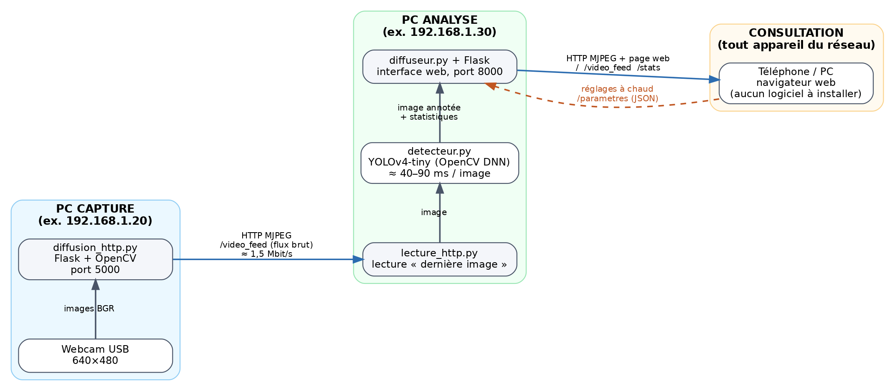
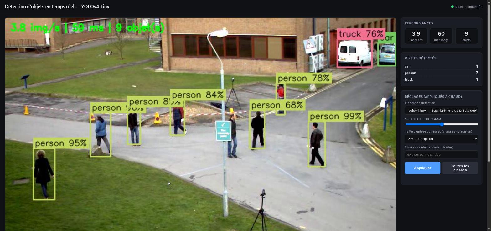
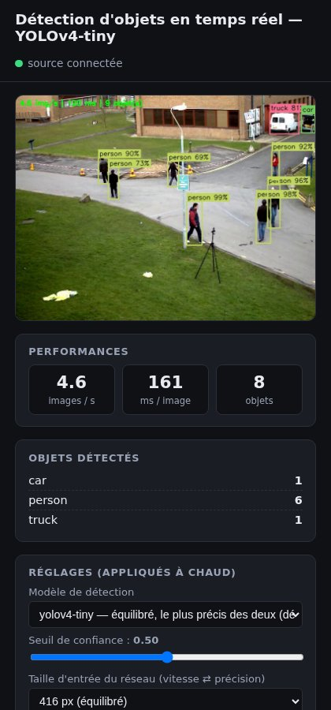

# Architecture distribuée pour le traitement d'images

**IA03 — Projet 1 · Rapport**

Auteurs : Mehdi Ez-Zouak, Paul Louis Ledoux et Clément Menaucourt · UTT, année 2 · septembre 2026

Dépôt du code : <https://github.com/Mehdi7765/ComputerVisionProjectIA03>

---

## 1. Objectif

Mettre en place une chaîne de traitement d'images **répartie sur plusieurs machines** d'un réseau local : une machine capture une webcam et diffuse le flux vidéo, une seconde applique un modèle de détection d'objets à chaque image, et n'importe quel appareil du réseau consulte le résultat annoté, en direct, avec un simple navigateur.

Le projet part des quatre scripts fournis en TP (`diffusion_http.py`, `lecture_http.py`, `diffusion_gstreamer.py`, `diffusion_rtsp_ffmpeg.py`), qui ont été conservés et adaptés. Chaque modification est repérée dans le code par un commentaire `[MODIF]` accompagné de sa raison, et les versions d'origine sont fournies dans `docs/scripts_origine/`.

## 2. Description de la solution

### 2.1 Vue d'ensemble



*Figure 1 — Architecture réellement déployée : trois rôles sur trois machines distinctes, reliés par HTTP. Les adresses sont des exemples ; les scripts affichent les vraies adresses au démarrage.*

La chaîne se compose de trois rôles, chacun porté par un script indépendant. N'importe quel ordinateur peut tenir n'importe quel rôle : il suffit de lancer le script correspondant.

| Rôle | Machine | Script | Entrée | Sortie |
|---|---|---|---|---|
| **Capture** | PC avec webcam | `diffusion_http.py` | webcam USB (640×480) | flux MJPEG brut, port 5000 |
| **Analyse** | PC avec CPU | `lecture_http.py` | flux brut du PC capture | flux MJPEG annoté + page web, port 8000 |
| **Consultation** | téléphone, PC, tablette | *(aucun)* | page web du PC analyse | affichage dans le navigateur |

### 2.2 Le PC capture : `diffusion_http.py`

Le script ouvre la webcam avec OpenCV et sert un flux **MJPEG** avec Flask : chaque image est compressée en JPEG et envoyée dans une réponse HTTP de type `multipart/x-mixed-replace`, ce qu'un navigateur affiche avec une simple balise `` et qu'OpenCV lit avec `cv2.VideoCapture(url)`.

Par rapport au script d'origine, la modification la plus importante concerne l'ouverture de la caméra. Dans la version fournie, `cv2.VideoCapture(0)` était appelé à l'intérieur de `generate_frames()`, donc **à chaque client HTTP** : avec une seule webcam physique, seul le premier client pouvait l'ouvrir, ce qui interdisait d'avoir à la fois le PC d'analyse et un navigateur de contrôle. La caméra est maintenant ouverte **une seule fois** et lue par un thread ; chaque client reçoit la dernière image capturée. Un mécanisme de reprise automatique relance l'ouverture si la caméra coupe.

### 2.3 Le PC analyse : `lecture_http.py`

Le script d'origine lisait le flux, écrivait un texte fixe sur chaque image et l'affichait dans une fenêtre. L'emplacement prévu pour « modifier l'image » accueille maintenant la **détection d'objets**, et l'image annotée est **rediffusée** sur le réseau selon le même principe que `diffusion_http.py`. Trois fils d'exécution cohabitent :

1. un **lecteur** (`LecteurDerniereImage`, dans `utilitaires.py`) lit le flux du PC capture en continu et ne conserve que la dernière image reçue ;
2. la **boucle d'analyse** prend cette image, appelle le détecteur, dessine les boîtes et un bandeau d'information, puis publie l'image annotée ;
3. le **serveur web** Flask sert la page de consultation, le flux annoté et deux points d'accès JSON (`/stats` pour les indicateurs, `/parametres` pour lire et modifier les réglages).

Le détecteur (`detecteur.py`) encapsule le modèle **YOLOv4-tiny** exécuté par le module DNN d'OpenCV sur le processeur. Pour chaque image : préparation d'un *blob* (mise à l'échelle, redimensionnement en 416×416, passage BGR → RGB), passage dans le réseau, décodage des sorties (coordonnées normalisées → pixels, classe la plus probable), puis suppression des boîtes redondantes (NMS). Le diffuseur (`diffuseur.py`) encode l'image annotée une seule fois en JPEG et la distribue à tous les spectateurs connectés.

### 2.4 La consultation : interface web



*Figure 2 — Interface de consultation sur un PC : flux annoté (personnes, camion, voiture), indicateurs en direct (images/s, latence d'inférence, nombre d'objets, compteur par classe) et réglages appliqués à chaud.*



*Figure 3 — La même interface sur un téléphone : la mise en page s'adapte à la largeur de l'écran.*

La page ne dépend d'aucune ressource extérieure (pas de CDN), ce qui garantit qu'elle fonctionne sur un réseau local sans accès Internet. Elle interroge `/stats` deux fois par seconde et relance l'image du flux d'elle-même en cas de coupure.

### 2.5 Formats des échanges et ports

| Échange | Format | Port | Pourquoi |
|---|---|---|---|
| Capture → analyse | MJPEG sur HTTP | 5000 | lisible par OpenCV et par un navigateur, un seul port TCP |
| Analyse → spectateurs | MJPEG sur HTTP + HTML | 8000 | affichable sans logiciel, plusieurs spectateurs |
| Spectateurs → analyse | JSON (`/parametres`) | 8000 | réglages à chaud, validation côté serveur |
| Supervision | JSON (`/etat`, `/stats`) | 5000, 8000 | diagnostic depuis n'importe quelle machine avec `curl` |

Tous les paramètres réseau (adresses, ports, résolution, qualité, seuils, modèles) sont regroupés dans **`config.py`** ; chaque script accepte des options en ligne de commande qui prennent le dessus, si bien qu'aucune adresse n'est écrite en dur et qu'on peut changer de réseau en séance sans éditer le code.

## 3. Justification des choix

### 3.1 Protocole de diffusion : MJPEG sur HTTP, plutôt que RTSP/H.264

Trois familles ont été considérées. Les deux variantes H.264 ont été **réellement implémentées et mesurées** (scripts `diffusion_rtsp_ffmpeg.py` et `diffusion_gstreamer.py`) avant d'être écartées comme diffusion principale.

| Solution | Débit (640×480) | Lisible par un navigateur | Multi-clients | Dépendances | Verdict |
|---|---|---|---|---|---|
| **MJPEG / HTTP** (Flask + OpenCV) | ≈ 1,4 Mbit/s mesuré | **oui**, balise `` | oui, trivial | Flask uniquement | **retenu** |
| H.264 / HTTP-MPEG-TS via ffmpeg | ≈ 0,5 Mbit/s (cible x264) | non | un seul (mode `-listen`) | binaire ffmpeg | variante fournie |
| H.264 / RTP-TCP via GStreamer | ≈ 0,5 Mbit/s (bitrate=500) | non | oui | OpenCV compilé avec GStreamer, sur les deux machines | variante fournie |
| WebRTC | faible | oui | oui | serveur de signalisation, bibliothèque `aiortc` | écarté : complexité disproportionnée |

Le critère décisif est l'**accessibilité depuis un simple navigateur**, sans logiciel ni plugin : seul le MJPEG le permet nativement. Il n'utilise qu'un port TCP (une seule règle de pare-feu), se déboguer avec `curl`, et son surcoût de débit (trois fois celui du H.264) est sans conséquence sur un réseau local. Le H.264 aurait imposé un lecteur (VLC) ou une conversion côté serveur, c'est-à-dire… une rediffusion en MJPEG. Les variantes H.264 restent utiles comme diffusion **capture → analyse** sur un réseau contraint : `lecture_http.py` sait les lire avec `--source`.

### 3.2 Modèle : YOLOv4-tiny via OpenCV DNN, plutôt que YOLOv8

| Solution | Précision | Vitesse CPU | Installation | Verdict |
|---|---|---|---|---|
| **YOLOv4-tiny** (OpenCV DNN) | correcte, 80 classes COCO | 40–60 ms/image | aucune : OpenCV déjà présent, 24 Mo de poids inclus dans le dépôt | **retenu** |
| YOLOv3-tiny (OpenCV DNN) | inférieure | comparable | idem, 34 Mo | fourni comme second modèle, changement à chaud |
| YOLOv8n (ultralytics) | supérieure | 100–200 ms/image sur CPU | PyTorch ≈ 2 Go à télécharger | écarté : trop lourd pour un `git clone` en séance, plus lent sans GPU |
| MobileNet-SSD (Caffe) | inférieure, 20 classes | rapide | légère | écarté : moins de classes, moins précis |

YOLOv4-tiny offre le meilleur compromis pour une démonstration **en temps réel sur CPU** : il tient 15 à 20 images par seconde sur un portable, ne demande aucune dépendance au-delà d'OpenCV, et ses fichiers tiennent dans le dépôt Git. Le choix reste ouvert : la taille d'entrée (320/416/608) et le modèle (v4-tiny / v3-tiny) se changent depuis l'interface, ce qui permet de montrer le compromis vitesse/précision en direct.

### 3.3 Emplacement du traitement : sur une machine dédiée

Faire tourner le modèle sur le PC capture aurait concentré toute la charge sur une seule machine et vidé l'architecture distribuée de son sens. Le traitement déporté a trois avantages : le PC capture reste léger (une webcam et Flask suffisent, un Raspberry Pi conviendrait), le calcul s'exécute sur la machine qui a le meilleur processeur, et les spectateurs n'ont rien à installer. Le coût est un saut réseau supplémentaire, mesuré à quelques dizaines de millisecondes sur un Wi-Fi correct.

### 3.4 Autres choix

- **Flask** plutôt que FastAPI ou Node : déjà utilisé dans le script du TP, suffisant pour du MJPEG, et présent dans les dépôts Debian.
- **JSON** pour les statistiques et les réglages : standard, lisible, testable avec `curl`.
- **Lecture « dernière image seulement »** : `cv2.VideoCapture` met les images en file d'attente ; si l'analyse est plus lente que la caméra, cette file grossit et le retard s'accumule (plusieurs secondes après une minute). Un thread lit le flux au rythme de la caméra et jette les images non traitées : l'analyse porte toujours sur l'image la plus récente.
- **Un seul encodage JPEG par image** quel que soit le nombre de spectateurs (`DiffuseurMJPEG`), avec une variable de condition pour réveiller les clients : un spectateur lent saute des images au lieu de ralentir les autres.

## 4. Difficultés rencontrées et solutions

| Difficulté | Diagnostic | Solution |
|---|---|---|
| **Le PC d'analyse n'atteint pas le PC capture** : `curl` expire, `ping` échoue, alors que la table ARP voit bien la machine | Un délai d'attente silencieux (et non un « connection refused » immédiat) trahit un **pare-feu** qui rejette les paquets sur le PC capture | Autoriser le port en entrée (règle Windows ou `ufw`). Documenté dans le README avec la méthode de diagnostic `ping` / `curl` |
| **La source RTSP publique du script d'origine** (`BigBuckBunny`) ne répond plus | Serveur de démonstration hors ligne | Remplacée par la webcam ; possibilité de diffuser un fichier vidéo avec `--camera fichier.mp4` |
| **`diffusion_rtsp_ffmpeg.py` échoue** avec « Connection refused » | Le drapeau `-rtsp_flags listen` n'agit que sur la *lecture* RTSP avec ffmpeg 5.1 ; en *écriture*, ffmpeg se comporte en client et cherche un serveur RTSP inexistant. Vérifié avec quatre combinaisons d'options | ffmpeg sert lui-même le flux H.264 en HTTP (`-listen 1`, MPEG-TS) ; mode `--mode rtsp` conservé pour pousser vers un serveur externe (mediamtx). Entrée adaptée à l'OS (`avfoundation` n'existe que sur macOS) |
| **`diffusion_gstreamer.py` n'est joignable que localement** et ne démarre pas | `tcpserversink host=127.0.0.1` n'écoute que sur la boucle locale ; l'encodeur `x264enc` refuse le format `BGR` demandé | `host=0.0.0.0`, format `I420`, redimensionnement systématique à la taille annoncée au `VideoWriter` |
| **Un seul client peut lire la webcam** | Caméra ouverte dans `generate_frames()`, donc une fois par client | Caméra ouverte une seule fois, thread de capture, image partagée |
| **Retard qui s'accumule** quand le modèle est plus lent que la caméra | File d'attente interne de `VideoCapture` | Lecteur « dernière image seulement » (§ 3.4) |
| **Adresse IP qui change** entre deux séances (DHCP, partage de connexion) | La valeur écrite dans `config.py` devient fausse | Les scripts affichent leur adresse au démarrage ; option `--source` ; QR code de l'interface dans le terminal |
| **Fenêtre OpenCV sur une machine sans écran** | `cv2.imshow` lève une exception | Fenêtre optionnelle : l'exception est rattrapée et l'analyse continue, la page web suffit |
| **Changer de modèle sans interrompre l'analyse** | Le réseau est utilisé par le thread d'analyse pendant que le serveur web le remplace | Le nouveau réseau est construit hors verrou, puis substitué entre deux inférences |

## 5. Mesures

Mesures réalisées sur un portable Debian 12 (processeur seul, sans GPU), les trois rôles sur la même machine, webcam 640×480.

| Configuration | Latence d'inférence | Débit d'analyse |
|---|---|---|
| YOLOv4-tiny, entrée 416 px | 51 à 63 ms | 14 à 17 images/s |
| YOLOv4-tiny, entrée 320 px | 25 à 38 ms | limité par la caméra (≈ 17 images/s) |
| YOLOv3-tiny, entrée 416 px | ≈ 80 ms (machine chargée) | comparable à v4-tiny dans les mêmes conditions |
| Débit du flux MJPEG brut (640×480, JPEG 80 %) | — | 1,44 Mbit/s |
| Deux spectateurs simultanés sur le flux annoté | — | 49 images chacun en 3 s, aucune dégradation |
| Coupure puis retour de la capture | reconnexion automatique en ≈ 2 s | — |

*À compléter en séance, sur la configuration réelle à deux PC + téléphone :* latence de bout en bout (chronomètre filmé), images/s côté analyse, nombre de spectateurs simultanés.

## 6. Au-delà de la demande initiale

Toutes ces fonctions sont **opérationnelles** et se montrent en séance :

- **Interface web** adaptée au téléphone, sans dépendance externe ;
- **Réglages à chaud** depuis l'interface : seuil de confiance, taille d'entrée du réseau, **filtre des classes** à détecter, **changement de modèle** (YOLOv4-tiny ↔ YOLOv3-tiny) sans redémarrage ni interruption du flux ;
- **Indicateurs en direct** : images/s, latence d'inférence, nombre d'objets et compteur par classe, bandeau incrusté dans la vidéo ;
- **Plusieurs spectateurs simultanés**, un seul encodage par image ;
- **Reprise automatique** après coupure de la caméra, du réseau ou du flux, côté capture, analyse et page web ;
- **Maîtrise de la latence** par la lecture « dernière image seulement » ;
- **Réduction du débit** : qualité JPEG et résolution réglables, variantes H.264 ;
- **Plusieurs sources** : webcam, fichier vidéo, flux HTTP/RTSP/GStreamer, mire de test ;
- **QR code** de l'interface affiché dans le terminal du PC d'analyse : un spectateur le scanne au lieu de taper l'adresse ;
- **Supervision** : `/etat` et `/stats` en JSON, messages de diagnostic explicites dans les terminaux.

## 7. Limites

- Le serveur web est celui de développement de Flask : adapté à une démonstration, pas à une mise en production.
- Le MJPEG consomme environ 1,4 Mbit/s par spectateur en 640×480 ; le débit total croît linéairement avec le nombre de spectateurs. Les variantes H.264 réduisent ce débit mais ne sont pas lisibles dans un navigateur.
- YOLOv4-tiny est moins précis qu'un modèle complet, surtout sur les objets petits ou partiellement masqués ; la latence de bout en bout typique est de 200 à 500 ms sur un Wi-Fi correct.
- En mode ffmpeg HTTP, un seul lecteur à la fois (suffisant, puisque la consultation passe par le PC d'analyse).
- Aucune authentification : toute personne connectée au réseau peut voir le flux et modifier les réglages.
- Certains points d'accès Wi-Fi (partages de connexion, réseaux publics) isolent les clients entre eux ; la démonstration exige un réseau qui autorise le trafic entre machines.

## 8. Procédure d'exécution

La procédure complète (installation par système, ordre de démarrage, adresses et ports à adapter, dépannage) se trouve dans le fichier `README.md` du dépôt. En résumé :

```bash
# PC capture
python diffusion_http.py
# PC analyse (adresse affichée par le PC capture)
python lecture_http.py --source http://<IP capture>:5000/video_feed
# Consultation : ouvrir http://<IP analyse>:8000/ dans un navigateur
```

## 9. Conclusion

La chaîne capture → analyse → consultation fonctionne sur trois machines distinctes, en direct, et le résultat annoté est accessible à tout appareil du réseau avec un simple navigateur. Les choix (MJPEG/HTTP, YOLOv4-tiny sur OpenCV, traitement déporté) ont été faits après avoir implémenté et mesuré les alternatives, et les scripts fournis en TP ont été conservés et adaptés plutôt que réécrits. Les difficultés rencontrées, pour l'essentiel réseau (pare-feu, adresses, isolation) et liées au comportement réel des outils (ffmpeg, GStreamer, `VideoCapture`), ont chacune trouvé une solution intégrée au code ou à la documentation.
